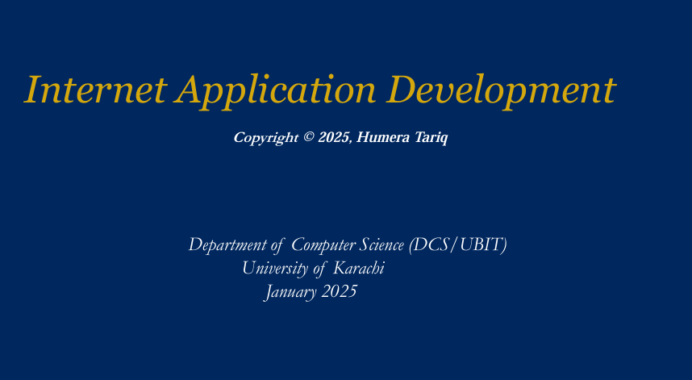

# BSCS-633 Internet Application Development – Assignments Repository
## 🚀 Overview
This repository contains all assignments for the **BSCS-633 (Internet Application Development)** course, completed during the **7th semester** of the **DCS UBIT UoK**.

 

## 🚀 Screenshots

 

## 🚀 Course Overview
BSCS-633 focuses on the development of modern web applications using core technologies such as:
- HTML, CSS, JavaScript
- Frontend frameworks like React
- Backend development with Node.js and Express
- Full Stack concepts using the MERN stack
- Firebase and Firestore
- REST APIs, CRUD operations

 

## 🚀 Technologies Used
- HTML5
- CSS3
- JavaScript
- React.js
- Node.js
- Express.js
- MongoDB
- Firebase
- Git & GitHub

 

## 🚀 Acknowledgements
Special thanks to **Dr. Humera** for her guidance and support throughout the semester.

 

## 🚀 License
Feel free to explore each folder and run the projects locally for learning or reference purposes.

 

## 🚀 Contact
- LinkedIn: www.linkedin.com/in/ibadhussain